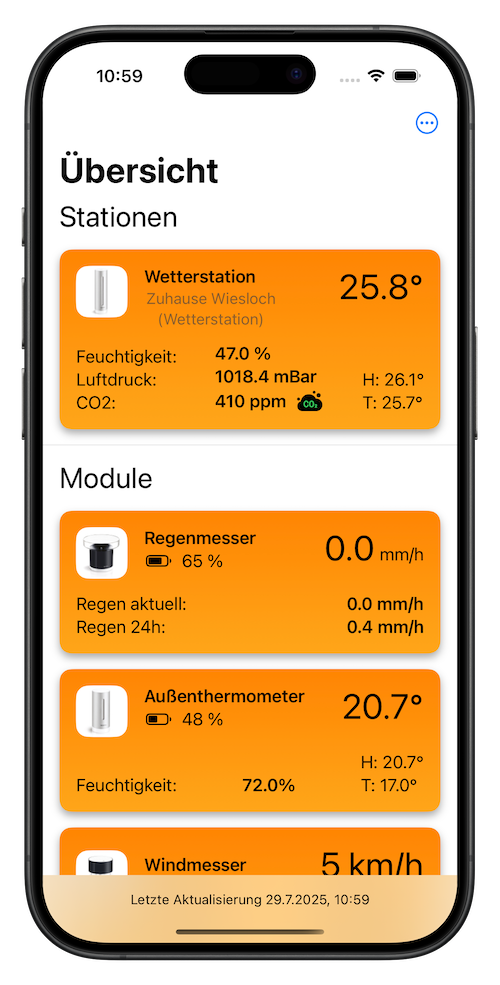
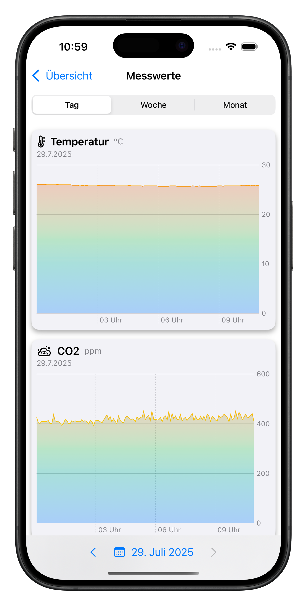
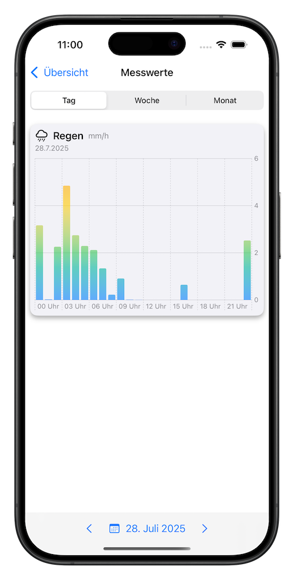
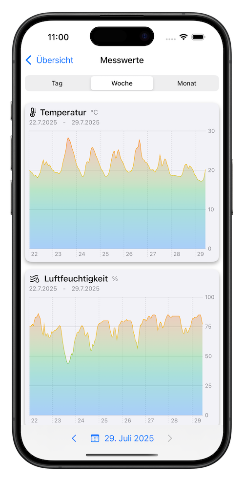
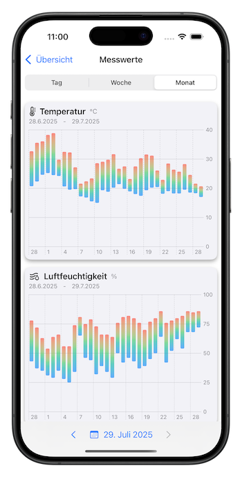
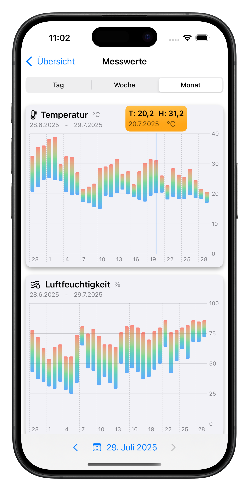
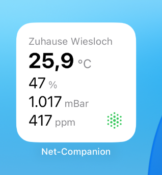
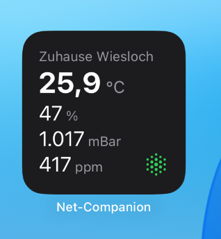

# NetCompanion App

**NetCompanion** ist eine native iOS-App für Nutzer von Netatmo-Wetterstationen. Sie bietet eine schnelle, werbefreie und datenschutzfreundliche Möglichkeit, alle Module im Überblick zu behalten – inklusive Temperaturverlauf und Statusinformationen aller Module. 

---

## 🚀 Funktionen

- Übersichtliche Anzeige aller Module (z. B. Innenraum, Außenmodul, Regenmesser) mit Kacheldesign
- Schnell erkennbare Statusanzeigen (Temperatur, Luftfeuchtigkeit, Batteriestand, Funkverbindung)
- Anzeige (je nach Modultyp) von:
  - Temperatur
  - Luftfeuchtigkeit
  - CO₂-Gehalt
  - Lärm
  - Luftdruck
  - Niederschlag
  - Windgeschwindigkeit
  - Batteriestatus
  - Verbindungsstatus
- Diagramme für Temperaturverläufe:
  - Tages-, Wochen- und Monatsansicht
- Premium-Freischaltung via StoreKit 2
  - Einmalkauf oder Abo
- WidgetKit-Integration: Daten direkt auf dem Homescreen
- Login via OAuth2 und Token (Apple Keychain-basiert, keine Passworteingabe notwendig)
- Datenschutzfreundlich – keine Datenweitergabe

---

## 🎯 Fokus

Der Fokus liegt besonders auf einer **klaren Benutzerführung**, einer **modernen Darstellung mit SwiftUI** und der **ansprechenden Visualisierung von Messwerten** (Temperatur, Luftfeuchtigkeit, Regen, CO₂ etc.) über verschiedene Zeiträume hinweg.

---

## 🛠️ Verwendete Technologien

- **Swift** & **SwiftUI**
- **StoreKit 2** für In-App-Käufe
- **Keychain** für sichere Token-Speicherung
- **WidgetKit** für iOS-Homescreen-Widgets
- **Swift Charts** für Diagramme
- **URLSession** mit `async/await` zur API-Kommunikation
- **OSLog** für strukturierte App-Logs

---

## 📸 Screenshots

### 📋 Hauptansicht
Übersicht über alle verfügbaren Netatmo-Module in einem modernen Kachellayout.

---

### 📈 Detailansicht – Temperatur (Tag)
Detailansicht eines Moduls mit Temperaturverlauf für einen Tag, dargestellt als Liniendiagramm.

---

### 🌧️ Regenmodul – Tagesansicht mit Bar-Chart
Regenmengen pro Stunde als Balkendiagramm.

---

### 📅 Wochen- und Monatsverlauf

#### Wochenansicht (Temperaturverlauf)

#### Monatsansicht (mit Höchst- und Tiefsttemperatur pro Tag)

#### Monatsansicht mit aktivem Popover (Drag-Geste)

---
## 🧩 Widget

Das Widget zeigt die aktuellen Werte der **Hauptstation** direkt auf dem Homescreen an.  
Es umfasst Temperatur, Luftfeuchtigkeit, Luftdruck und CO₂-Wert.  
Das Layout passt sich automatisch dem Light- oder Dark Mode des Geräts an.

---

## 🎥 Demo

Ein animiertes GIF zeigt die wichtigsten Ansichten und Interaktionen der App:

- Modulübersicht mit Temperatur, Luftfeuchtigkeit, Batteriestatus
- Detailansicht mit Charts (Tag, Woche, Monat)
- Drag-Geste zum Einblenden von Popover-Details

*Live-Demo ohne Geräte-Rahmen (Bezel)*

---

## 🎯 Motivation

Ich habe NetCompanion als native Alternative zur Web- oder Hersteller-App entwickelt, um meine eigene Netatmo-Wetterstation sinnvoll auszuwerten. Dabei lag der Fokus darauf, moderne SwiftUI-Techniken mit echten APIs, sicherer Tokenverarbeitung und Apple-Frameworks wie StoreKit 2, Charts und WidgetKit sinnvoll zu verknüpfen.

Aktuell arbeite ich an einer Veröffentlichung im App Store.

---

## 📂 Hinweis zum Repository

> Dieses Repository dient aktuell nur der **Präsentation** meiner App und der **Visualisierung** des Projekts für Interessierte, potenzielle Auftraggeber oder Teams.  
> Der Quellcode ist nicht öffentlich.  
> Bei Interesse an einer technischen Zusammenarbeit → gerne Kontakt aufnehmen.

---

## 🧑‍💻 Autor

**Marco Witt**  
iOS-Developer | SwiftUI-Enthusiast  
[LinkedIn](https://www.linkedin.com/in/marco-witt-1265301b6)
